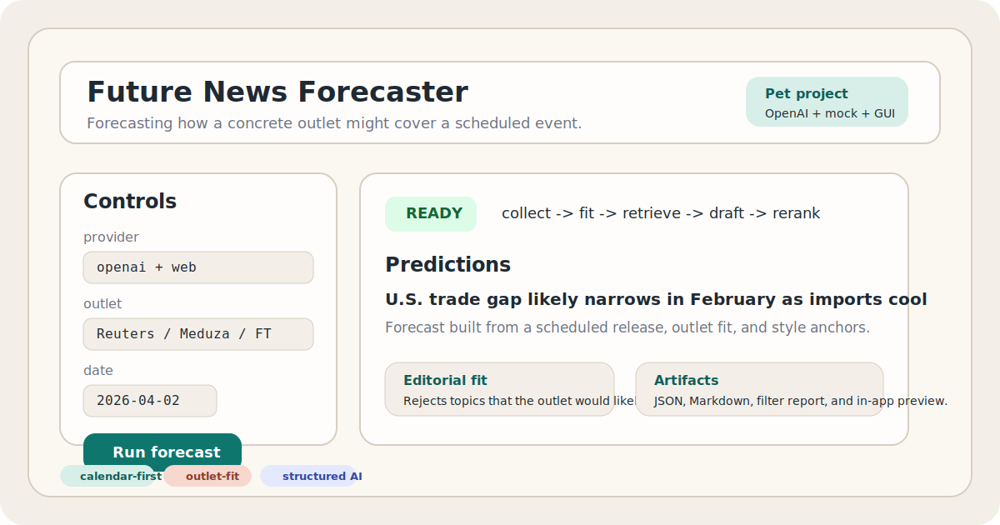
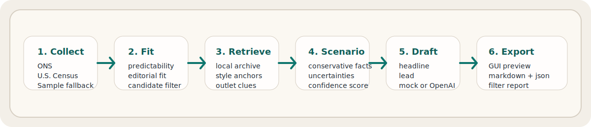

# Future News Forecaster

<p align="center">
  
</p>

<p align="center">
  <strong>Pet project</strong> про прогнозирование того, как конкретное медиа оформит заранее известный инфоповод.
</p>

<p align="center">
  
  
  
  
</p>

`Future News Forecaster` не пытается "предсказать будущее вообще".  
Его задача уже и честнее: взять **запланированное событие**, оценить **подходит ли оно выбранному изданию**, и построить аккуратный прогноз того, каким может быть **headline + lead**.

Сейчас проект лучше всего работает на **календарных макроэкономических и статистических релизах** и не скрывает своих ограничений.

## Что это за проект

Это небольшой newsroom-oriented pet project про три вещи:

- прогноз новости должен начинаться с реального ожидаемого события, а не с фантазии модели
- для качества важен не только стиль текста, но и вопрос: стало бы это медиа вообще писать на эту тему
- система должна уметь честно вернуть `0 кандидатов`, если событие не проходит по редакционному fit

Поэтому в проекте есть отдельный этап `editorial fit`, который фильтрует темы до генерации текста.

## Что умеет

- собирать события из подключенных календарей релизов
- оценивать предсказуемость события и его релевантность конкретному изданию
- искать style anchors в локальном архиве, если он есть
- сначала строить осторожные сценарии, а потом писать headline + lead
- ранжировать результаты и экспортировать их в JSON / Markdown
- показывать прогноз, лог и причины фильтрации прямо в desktop GUI

## Как работает pipeline

<p align="center">
  
</p>

Логика простая:

`collect -> fit -> retrieve -> scenario -> draft -> export`

То есть сначала проект ищет ожидаемое событие, потом проверяет подходит ли оно выбранному СМИ, и только после этого начинает писать текст.

## Что такое fit и score

Внутри проекта есть несколько служебных оценок. Это не "истина", а рабочие эвристики, которые помогают не генерировать слабые или натянутые новости.

`editorial fit`

- Это оценка того, **насколько выбранное СМИ вообще стало бы писать про это событие**.
- Например, для Reuters fit по макростатистике обычно высокий.
- Для Meduza fit по рутинному британскому статистическому релизу может быть низким, и тогда событие просто отсекается.

`predictability score`

- Это оценка того, **насколько событие предсказуемо как инфоповод**.
- Чем событие более календарное, официальное, подтвержденное и похожее на типичный релиз, тем score выше.

`style match`

- Это оценка того, **насколько сгенерированный текст похож на найденные примеры этого издания**.
- Если локального архива для издания нет, эта часть работает слабее.

`template match`

- Это оценка того, **насколько текст вообще похож на типичный формат такого рода новости**.
- У условного macro release и у спортивной новости разные шаблоны подачи, и система это учитывает.

`total score`

- Это итоговая комбинированная оценка кандидата.
- Она собирается из predictability, editorial fit, template match, style match и confidence сценария, с штрафами за слишком смелые или сомнительные формулировки.
- Именно по `total score` сервис выбирает лучшие варианты в финальный список.

Если коротко:

- `fit` отвечает на вопрос: **подходит ли тема этому СМИ**
- `score` отвечает на вопрос: **насколько этот конкретный прогноз хорош по качеству**

Поэтому иногда проект возвращает `0 кандидатов`. Это значит не "сервис сломался", а "на эту дату среди доступных событий не нашлось тем, которые это издание с высокой вероятностью взяло бы в работу".

## Источники событий сейчас

Пока live-слой событий у проекта узкий и это осознанное ограничение:

- [ONS release calendar](https://www.ons.gov.uk/releasecalendar?page=4&release-type=type-upcoming)
- [U.S. Census economic indicators calendar](https://www.census.gov/economic-indicators/calendar-listview.html)
- встроенный sample fallback для стабильных offline-демо

Из-за этого проект сейчас лучше всего подходит для таких сценариев:

- Reuters / Bloomberg / Financial Times / деловые агентства
- макрорелизы, торговая статистика, опросы, официальные публикации
- предсказуемые newsroom-сюжеты с известной датой выхода

## Ограничения

Этот репозиторий не пытается выглядеть "универсальным ИИ для любых новостей". Ограничения здесь часть продуктовой логики:

- live-источники событий сейчас в основном UK/US и в основном про макроэкономику и статистику
- web search помогает уточнять контекст, но не заменяет собой полноценную базу событий
- не каждое медиа пишет по таким календарям, поэтому для части изданий нормальный итог это `0 кандидатов`
- стиль издания определяется лучше, если есть локальный архив вроде `data/archives/<outlet>_sample.jsonl`
- breaking news, городская повестка, lifestyle, культура и спорт сейчас покрываются слабо

Для selective-изданий вроде `Медузы` рутинные британские релизы часто будут отсеяны. Это не баг, а ожидаемое поведение.

## Какие кейсы подходят лучше всего

Реалистичные fit-сценарии для текущей версии:

- Reuters / Bloomberg / Financial Times: `U.S. International Trade in Goods and Services`
- Reuters: `Economic activity and social change in the UK, real-time indicators`
- Reuters: `Business insights and impact on the UK economy`
- Meduza: скорее темы с более широким экономическим или геополитическим углом, чем обычная ONS-статистика

## Desktop App

В проекте есть Tkinter-приложение с:

- вводом и сохранением OpenAI API key в `.env`
- выбором провайдера, даты, издания и числа прогнозов
- выводом прогноза прямо в окне
- вкладкой `Отбор тем`, где видно почему темы были отсеяны
- вкладкой с идеей проекта и ограничениями

## Быстрый старт

Установка:

```bash
python -m pip install -e .
```

Запуск GUI:

```bash
python -m future_news_forecaster gui
```

Offline-демо:

```bash
python -m future_news_forecaster run --date 2026-04-02 --offline --provider mock --out-dir results/offline-demo
```

Live-запуск с auto provider:

```bash
python -m future_news_forecaster run --date 2026-04-02 --provider auto --out-dir results/live-run
```

Принудительный OpenAI-режим:

```bash
set OPENAI_API_KEY=your_key_here
python -m future_news_forecaster run --date 2026-04-02 --provider openai --model gpt-5-mini
```

Отключить веб-поиск OpenAI:

```bash
python -m future_news_forecaster run --date 2026-04-02 --provider openai --no-web-search
```

## Куда вводить OpenAI key

Есть два варианта:

1. через поле в GUI и кнопку `Сохранить ключ`
2. вручную в `.env` в корне проекта

```bash
OPENAI_API_KEY=your_key_here
```

## Что сохраняется после запуска

Каждый run пишет:

- `collected_events.json`
- `forecast_run.json`
- `forecast_run.md`
- `editorial_filter.md`

## Структура проекта

```text
src/future_news_forecaster/
  collectors/         collectors календарей
  generation.py       mock + OpenAI генерация
  retrieval.py        поиск style anchors в архиве
  scoring.py          scoring и editorial fit
  pipeline.py         orchestration всего пайплайна
  gui.py              desktop GUI
  cli.py              CLI entrypoint
data/archives/
  reuters_sample.jsonl
docs/project-concept/
  README.md
  principles.md
docs/assets/
  cover.svg
  workflow.svg
```

## Технические заметки

- `mock` режим дает детерминированные локальные прогоны для тестов и демо
- OpenAI-режим использует Structured Outputs через Responses API
- web search в OpenAI используется как дополнительный контекст, а не как замена event layer
- `provider=auto` откатывается в `mock`, если OpenAI недоступен

## Roadmap

- добавить больше календарей событий помимо ONS и Census
- расширить архивы под разные издания
- улучшить не только стиль, но и coverage-модель: стало бы издание вообще писать об этом
- добавить более сильный retrieval по большим наборам материалов
- сделать GUI еще ближе к newsroom/demo-tool формату

## Дополнительные материалы

- описание идеи: [`docs/project-concept/README.md`](docs/project-concept/README.md)
- принцип работы: [`docs/project-concept/principles.md`](docs/project-concept/principles.md)
